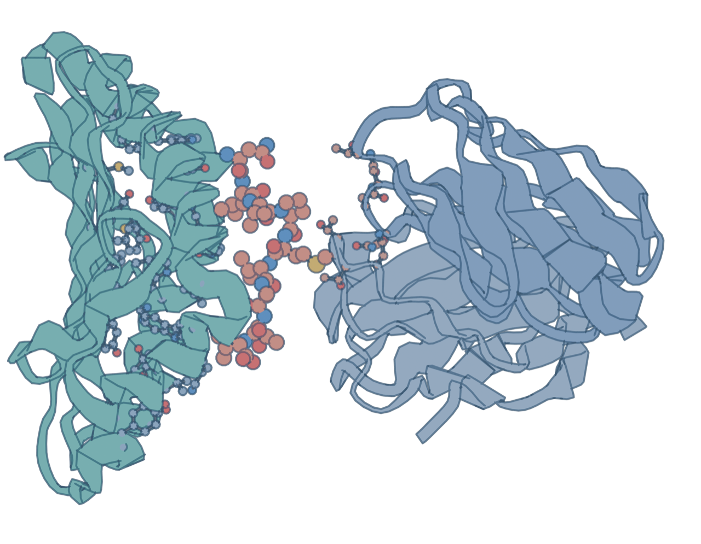

<p align="center">
  
</p>

# LAMINA

**LAtent Motif INteraction Aggregation** is an interpretable model of peptide–HLA class I binding and presentation. LAMINA maps a 34-residue HLA pseudosequence and an 8–14-residue peptide to linear latent motifs, scores their interactions, and aggregates them into a prediction. Its raw logits decompose exactly into contributions from individual HLA–peptide residue pairs.

## Repository layout

| Path | Purpose |
| --- | --- |
| `final_models/lamina_ba.pt` | Binding-affinity model; used for affinity prediction and every interpretation analysis. |
| `final_models/lamina_el.pt` | Eluted-ligand model; used for source-protein ranking (FRANK). |
| `src/lamina.py` | Fixed LAMINA architecture, sequence encoding, and checkpoint loading. |
| `src/attribution.py` | Shared residue attribution for the notebook and structural analysis. |
| `src/io_utils.py` | JSONL readers and file/code identities. |
| `src/train_lamina.py` | Training recipe for either task. |
| `src/prepare_netmhcpan_data.py` | Format the public BA/EL training folds. |
| `evals.ipynb` | Run all six affinity predictors, three FRANK predictors, and summary statistics. |
| `interpretable.ipynb` | Exact attribution, sequence logos, SMM comparison, structural results, and molecular views. |
| `src/discover_pmhc_structures.py`, `src/build_pmhc_distance_matrices.py` | Discover structures, map deposited HLA residues, and compute distances. |
| `src/peptide_sasa.py`, `src/run_foldx_peptide_scan.py`, `src/structural_analysis.py` | Compute and analyze solvent exposure, mutation energies, and exact contributions. |
| `src/hla_residue_mapping.py`, `src/pmhc_mhci_common.py`, `src/hla_a_mature_P04439.json` | Shared coordinate parsing and the mature HLA-A reference. |
| `Data/`, `external/` | Local downloads and external predictors; created during setup and ignored by Git. |
| `checkpoints/`, `artifacts/` | Retrained weights and analysis tables; ignored by Git. |

## Installation

Run all commands from the repository root. Use Python 3.11 or newer. The pinned analysis packages were checked with Python 3.14.3; external native executables must also support your operating system and architecture.

```bash
python -m venv .venv
source .venv/bin/activate
python -m pip install --upgrade pip
python -m pip install -r requirements.txt
python -m ipykernel install --user --name lamina --display-name LAMINA
```

Only the predictive comparison needs `requirements-evaluation.txt`, the five external predictors, and Java. Only the mutation scan needs a separately installed FoldX executable.

## Training data

Download `NetMHCpan_train.tar.gz` from the [DTU NetMHCpan-4.2 legacy training-data page](https://services.healthtech.dtu.dk/services/NetMHCpan-4.2/legacy/).

```bash
mkdir -p Data/NetMHCpan
curl -fL --retry 3 \
  https://services.healthtech.dtu.dk/suppl/immunology/NetMHCpan-4.2/NetMHCpan_train.tar.gz \
  -o Data/NetMHCpan/NetMHCpan_train.tar.gz
```

```bash
tar -xzf Data/NetMHCpan/NetMHCpan_train.tar.gz -C Data/NetMHCpan
python src/prepare_netmhcpan_data.py
```

The extracted directory must contain `pseudoseqs`, `allelelist`, and `c000_ba` through `c004_ba` plus `c000_el` through `c004_el`. The formatter writes BA and EL rows to `Data/NetMHCpan/netmhcpan_training.jsonl.gz`, with a companion summary of input files and skipped rows.

Each JSONL row has `dataset`, `peptide`, `target`, and `pseudosequences`. Multi-allelic EL examples retain all candidate pseudosequences.

Keep this training table even when using the released weights: the evaluation notebook needs the complete BA/EL pair universe to remove overlap from both evaluation cohorts and FRANK candidate pools.

## Models and training

The notebooks default to the released weights in `final_models/`.

Train either task with:

```bash
python src/train_lamina.py ba
python src/train_lamina.py el
```

These commands write `checkpoints/lamina_ba.pt` and `checkpoints/lamina_el.pt`, each with a JSON sidecar recording the recipe, environment, and input/code hashes. To evaluate these runs, change `BA_CHECKPOINT` and `EL_CHECKPOINT` in the notebooks to the files under `checkpoints/`. The released weights are preserved.

The fixed recipe uses 15,000 AdamW steps, learning rate `5e-4` decaying linearly to zero, weight decay `0.1`, gradient clipping at `1.0`, and a valid-motif activation penalty of `1e-4`. Four mean-reduced microbatch losses are accumulated per step, with a maximum microbatch size of 8,192. BA uses MSE on sigmoid-normalized affinity; EL uses binary cross-entropy on logits. Seeds are zero.

For a small inference example:

```python
import torch
from src.lamina import encode_batch, load_model

model = load_model("final_models/lamina_ba.pt", torch.device("cpu"))
hla, _ = encode_batch(["YFAMYGEKVAHTHVDTLYVRYHYYTWAVLAYTWY"], 34)
peptide, lengths = encode_batch(["GILGFVFTL"], 14)
with torch.inference_mode():
    logits, _ = model(hla, peptide, lengths)
    normalized_affinity = torch.sigmoid(logits)
    affinity_nm = 50000 ** (1 - normalized_affinity)
print(affinity_nm.item())
```

Larger normalized affinity means stronger binding. For the EL checkpoint, sigmoid gives the presentation score; FRANK uses raw logits to avoid sigmoid saturation ties.

## Predictive evaluation

Download recent IEDB binding measurements and the Pearson eluted-ligand dataset, then attach UniProt source-protein sequences:

```bash
python src/download_iedb_eval_data.py
python src/download_source_proteins.py
python -m pip install -r requirements-evaluation.txt
mhcflurry-downloads fetch models_class1_presentation
mkdir -p external
```

The notebook removes peptide–pseudosequence pairs found in the training data, evaluates affinity predictions, and measures source-protein ranking with FRANK. Cohort sizes depend on the downloaded data.

Install the following upstream predictors and their distributed weights:

| Predictor | Version and location |
| --- | --- |
| [NetMHCpan](https://services.healthtech.dtu.dk/services/NetMHCpan-4.2/) | 4.2; install the matching native distribution and its data under `external/netMHCpan-4.2/`. |
| [MHCflurry](https://github.com/openvax/mhcflurry) | 2.2.1 with `models_class1_presentation`, downloaded above. |
| [DeepAttentionPan](https://github.com/jjin49/DeepAttentionPan) | Commit `c1ed9b9e3773a70165c18d56533611e2a719b884`, including its twenty ensemble weights. |
| [ANTHEM](https://github.com/17shutao/Anthem) | Commit `410f11530c9fae61012916c5210b1d220598ba11`, including models and the bundled Weka JAR; `java` must be on `PATH`. |
| [TransPHLA-AOMP](https://github.com/a96123155/TransPHLA-AOMP) | Commit `3ed2260292934170757507a71e645d0bcadfc44b`, including the released model and HLA sequence data. |

```bash
git clone https://github.com/jjin49/DeepAttentionPan.git external/DeepAttentionPan
git -C external/DeepAttentionPan checkout c1ed9b9e3773a70165c18d56533611e2a719b884
git clone https://github.com/17shutao/Anthem.git external/ANTHEM
git -C external/ANTHEM checkout 410f11530c9fae61012916c5210b1d220598ba11
git clone https://github.com/a96123155/TransPHLA-AOMP.git external/TransPHLA-AOMP
git -C external/TransPHLA-AOMP checkout 3ed2260292934170757507a71e645d0bcadfc44b
```

Open `evals.ipynb`, select the LAMINA kernel, inspect its first code cell, and run every cell in order. Set the NetMHCpan binary/platform/data paths to your actual installation if its directory layout differs. All external tools must be installed for the full comparison. Full FRANK scoring can take hours.

Prediction and metric CSVs, cohort counts, and pairwise tests are written to `artifacts/evals/`.

## Logos and the SMM comparison

Download the [IEDB SMM/SMMPMBEC matrix archive](https://tools.iedb.org/mhci/download/):

```bash
mkdir -p Data/reference_motifs
curl -fL \
  https://tools.iedb.org/static/download/IEDB_MHC_I-2.9_matx_smm_smmpmbec.tar.gz \
  -o Data/reference_motifs/IEDB_MHC_I-2.9_matx_smm_smmpmbec.tar.gz
```

Run the cells in `interpretable.ipynb` through the SMM comparison. These cells require only the BA checkpoint, NetMHCpan pseudosequence table, and SMM archive; structural calculations can be prepared separately.

The notebook checks exact residue-pair attribution completeness and computes each 9-mer preference table using 180 substitutions. Logos use position-centered **raw logits**.

## Structural analysis

### Coordinates

The structural tools use a local [wwPDB mmCIF archive](https://files.wwpdb.org/pub/pdb/data/structures/divided/mmCIF/). Store files under `Data/PDB/` in the divided layout, for example `Data/PDB/p9/3p9m.cif.gz`, or pass an existing mirror with `--pdb-root`.

Discover entries containing MHC class I and a candidate peptide, then build the residue maps and distance matrices:

```bash
python src/discover_pmhc_structures.py --pdb-root Data/PDB
python src/build_pmhc_distance_matrices.py \
  --candidates artifacts/pmhc_mhci_candidates.jsonl \
  --pdb-root Data/PDB \
  --output artifacts/pmhc_mhci_distance_matrices.jsonl
```

This aligns deposited heavy-chain sequences to mature HLA-A P04439 and recomputes residue maps, minimum-heavy-atom distances, and the two fixed structural screens.

### Solvent accessibility

```bash
python src/peptide_sasa.py \
  --records artifacts/pmhc_mhci_distance_matrices.jsonl \
  --pdb-root Data/PDB \
  --output artifacts/peptide_sasa.jsonl \
  --workers 8
```

Biopython 1.87 computes bound and free peptide SASA using a 1.4 Å probe and 200 sphere points. Free peptide coordinates are identical to the bound coordinates, with no relaxation. Modified polymer atoms remain in both states; unsupported maximum-ASA normalization excludes a site only from relative-SASA classification.

Saved SASA results record the calculation settings, Biopython version, input hashes, and syntax hashes of `peptide_sasa.py`, `pmhc_mhci_common.py`, and `io_utils.py`. Code identity excludes comments, whitespace, and docstrings. Changes to executable code in any of these modules invalidate saved results. Results from the older single-file checksum format must be regenerated once with the command above.

### FoldX mutation energies

Obtain [FoldX](https://foldxsuite.crg.eu/) and its rotamer database separately, and place the executable and `rotabase.txt` under `Data/FoldX/`.

```bash
python src/run_foldx_peptide_scan.py \
  --records artifacts/pmhc_mhci_distance_matrices.jsonl \
  --pdb-root Data/PDB \
  --foldx-bin Data/FoldX/foldx \
  --output artifacts/foldx_peptide_scan.csv
```

The runner creates two-chain inputs, repairs the wild type, measures its interface energy, mutates each peptide residue to alanine (alanine to glycine), and measures each mutant interface.

The analysis requires wild-type interaction energy ≤ −5 kcal/mol, at least ten wild-type interface residues, and at least one mutant interface residue; nonfinite and numerically zero energies are removed.

### Analysis and molecular views

```bash
python src/structural_analysis.py \
  --structures artifacts/pmhc_mhci_distance_matrices.jsonl \
  --checkpoint final_models/lamina_ba.pt \
  --sasa artifacts/peptide_sasa.jsonl \
  --foldx-results artifacts/foldx_peptide_scan.csv \
  --pdb-root Data/PDB \
  --output artifacts/interpretability
```

The command writes residue tables, summary statistics, and run metadata under `artifacts/interpretability/`. The remaining cells of `interpretable.ipynb` display FoldX and SASA plots directly, alongside interactive molecular views. Set `DISPLAY_PDBS` to choose entries from your structural cohort; the defaults are 3P9M and 7K80. Peptide colors show their exact contributions, and HLA colors project the nearest peptide contribution spatially.

The repository includes BA and EL state dictionaries in `final_models/`. Datasets, derived result tables, and run manifests are generated locally by the commands above; they are not bundled with this checkout. The model loader accepts the state-dictionary format written by `src/train_lamina.py`.